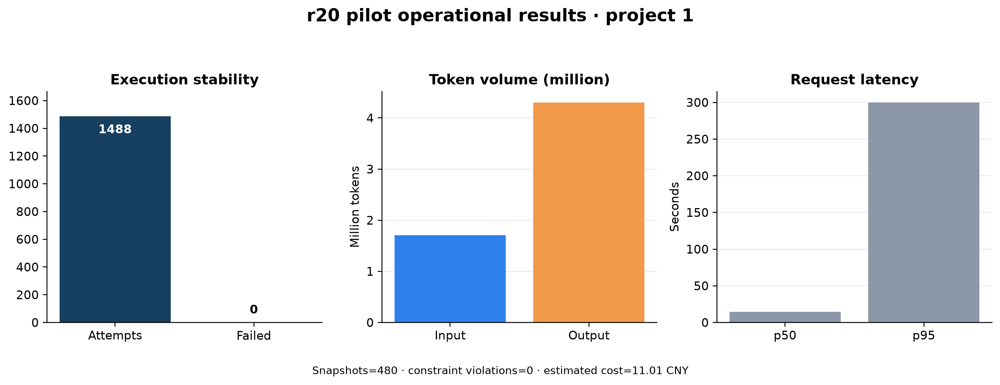
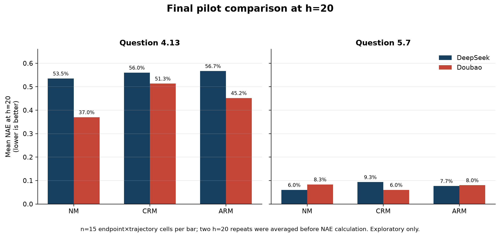
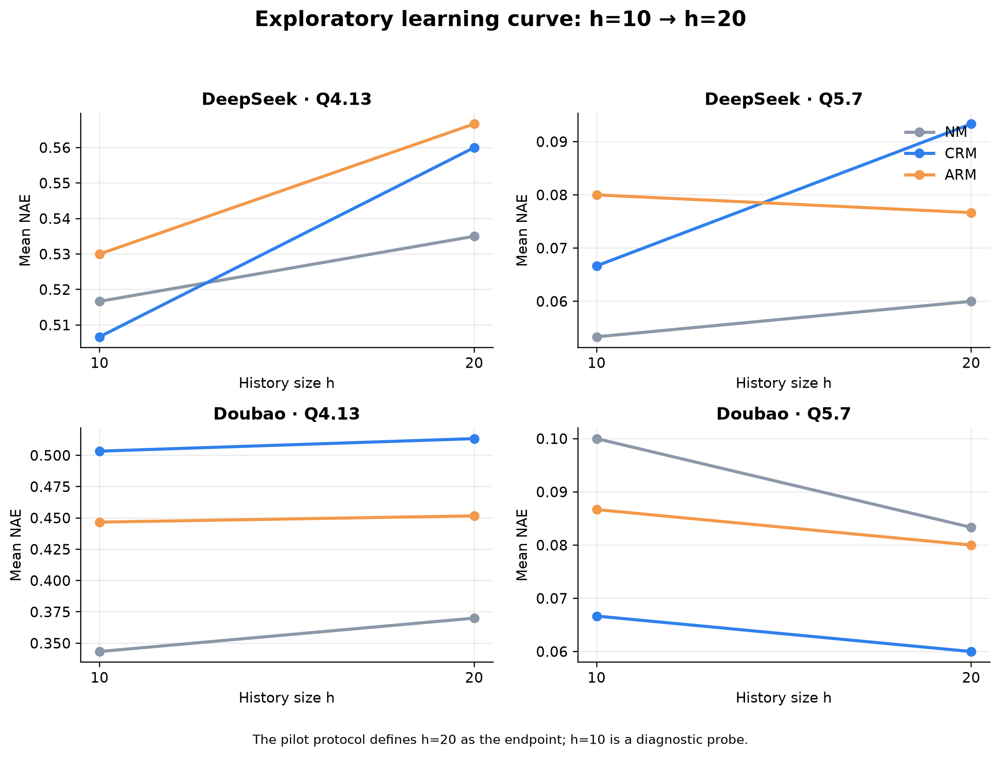
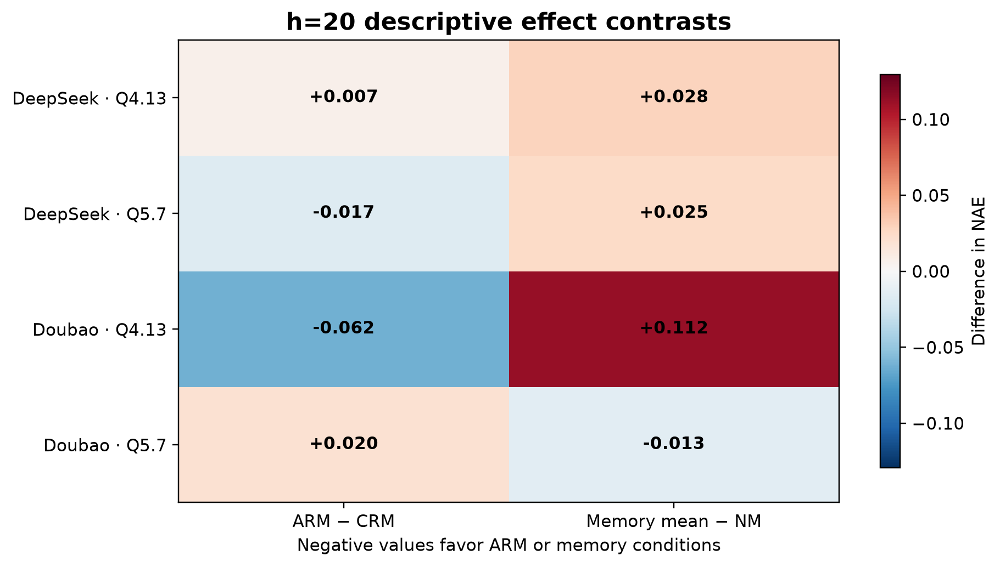

# 项目1技术试点可视化结果

- 题目：`4.13`、`5.7`；项目状态：`completed`；完成时间：`2026-08-20T17:07:00.211178`。
- 试点执行：1488 次 attempts，失败调用 0；输入 1,708,717 tokens，输出 4,304,656 tokens。
- 记忆约束检查：480 个 snapshot，最大可见 token 数 263，违规 0 次。
- 延迟：p50 14.77s，p95 300.06s；估算成本 11.01 元。

## 图表

## h=20 描述性读数

NAE 越低越好；每个柱为 15 个 endpoint×trajectory 单元，重复评分先平均再计算误差。

| 模型 | 题目 | NM | CRM | ARM | ARM−CRM | memory mean−NM |
|---|---:|---:|---:|---:|---:|---:|
| DeepSeek | 4.13 | 0.5350 | 0.5600 | 0.5667 | +0.0067 | +0.0283 |
| DeepSeek | 5.7 | 0.0600 | 0.0933 | 0.0767 | -0.0167 | +0.0250 |
| Doubao | 4.13 | 0.3700 | 0.5133 | 0.4517 | -0.0617 | +0.1125 |
| Doubao | 5.7 | 0.0833 | 0.0600 | 0.0800 | +0.0200 | -0.0133 |

## 解释边界

这些 NAE 图是根据用户要求对已完成技术试点做的事后探索性解封，不改变系统中 `pilot_technical_only` 的锁定报告状态，也不构成正式 RQ1/RQ2 结论。样本只有两道试点题，不能据此推广到正式题、其他模型或总体准确率。

原始汇总只保留聚合字段；未导出学生答案、教师反馈、提示词或模型输出 payload。
