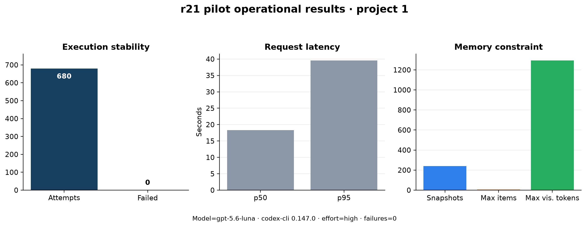
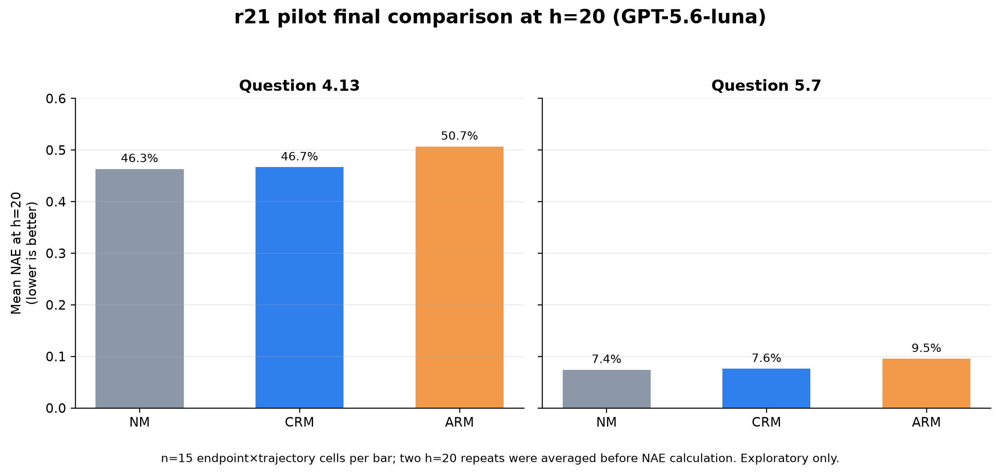
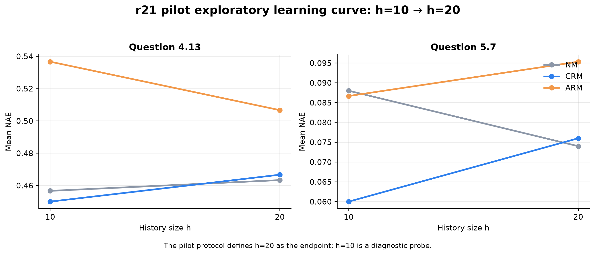
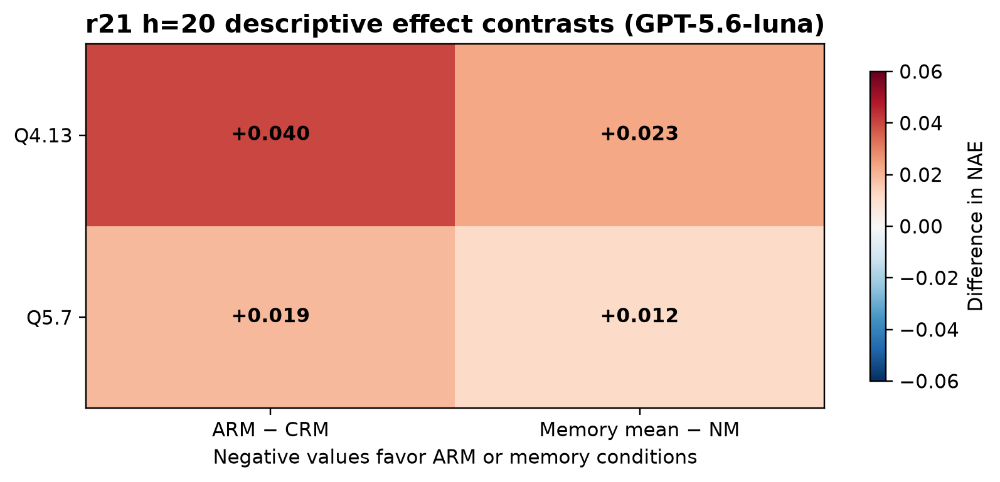

# 项目1 · r21 技术试点可视化结果

- 题目：`4.13`、`5.7`；项目状态：`completed`；完成时间：`2026-08-26T05:15:26.060838`。
- 模型：`gpt-5.6-luna`（codex-cli 0.147.0，reasoning_effort=high）。
- 试点执行：680 次 attempts，失败调用 0。
- 记忆约束检查：240 个 snapshot，最大可见 token 数（近似）1295。
- 延迟：p50 18.33s，p95 39.60s。

## 图表

## h=20 描述性读数

NAE 越低越好；每个柱为 15 个 endpoint×trajectory 单元，重复评分先平均再计算误差。

| 题目 | NM | CRM | ARM | ARM−CRM | memory mean−NM |
|---|---:|---:|---:|---:|---:|
| 4.13 | 0.4633 | 0.4667 | 0.5067 | +0.0400 | +0.0233 |
| 5.7 | 0.0740 | 0.0760 | 0.0953 | +0.0193 | +0.0117 |

## 解释边界

这些 NAE 图是根据用户要求对已完成技术试点做的事后探索性解封，不改变系统中 `pilot_technical_only` 的锁定报告状态，也不构成正式 RQ1/RQ2 结论。样本只有两道试点题，不能据此推广到正式题、其他模型或总体准确率。

原始汇总只保留聚合字段；未导出学生答案、教师反馈、提示词或模型输出 payload。
